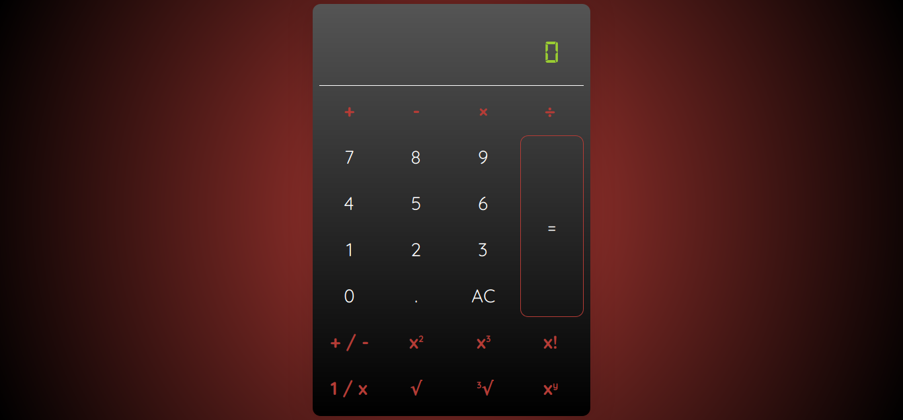

### ✨ [Calculator (Click to see live version)](https://krrb-prod-calculator-avion.netlify.app/)

>> ###### Features:
>> - [x] consecutive calculations
>> - [x] assets are minified using gulp
>> - [x] added Jest test using jsdom to automate user clicks/calculations
>> - [x] supports operations for whole and decimal numbers
>> - [x] supports positine/negative integers
>> - [x] supports square, cube and factorial of a number
>> - [x] supports fractions, square and cube roots and exponents

## Author: <i>Kevin Roi R. Basina</i>

<a href="https://www.facebook.com/kevinroibasina">
	
<a>

