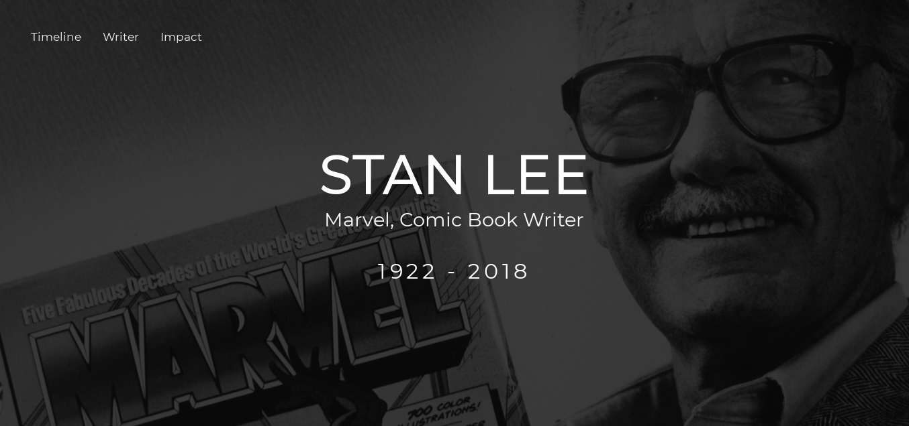
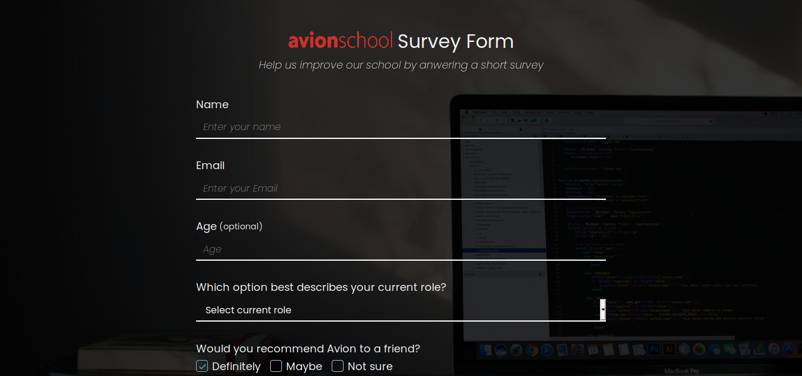

### ✨ [1. Tribute Page (Click to see live version)](https://krrb-prod-tribute-page.netlify.app/)

> This project is focused on the usage of basic HTML & CSS structure as instructed by Avion School instructors

### ✨ [2. Survey Form (Click to see live version)](https://krrb-prod-survey-form.netlify.app/)

> This project is focused on the usage of basic HTML & CSS structure as instructed by Avion School instructors

### ✨ [3. Product Landing Page (Click to see live version)](https://krrb-prod-product-landing-page.netlify.app/)

> This project is focused on the usage of CSS flexbox and other concepts taught prior this project as instructed by Avion School instructors

### ✨ [4. Avion School Page (Click to see live version)](https://krrb-prod-avionschool.netlify.app/)

> This project is focused on the usage of CSS flexbox and other concepts taught prior this project as instructed by Avion School instructors. Final project before moving into javascript.

## Author

👤 **Kevin Roi R. Basina**

* Twitter: [@tymmchineni\_roi](https://twitter.com/tymmchineni_roi)
* Github: [@rookiemonkey](https://github.com/rookiemonkey)
* LinkedIn: [@Kevin Roi Rigor Basina](https://ph.linkedin.com/in/kevin-roi-rigor-basina-668136185)
