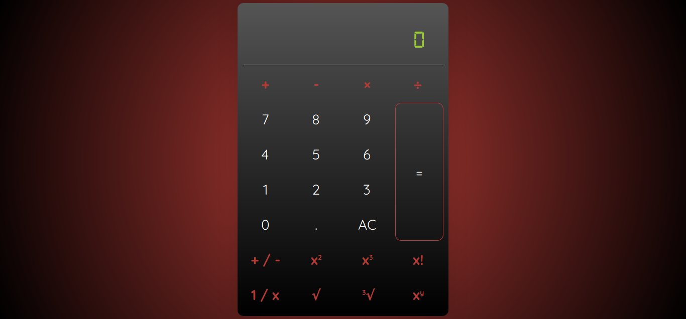

### ✨ [1. Tribute Page (Click to see live version)](https://krrb-prod-tribute-page.netlify.app/)

> This project is focused on the usage of basic HTML & CSS structure as instructed by Avion School instructors

>> ###### Features:
>> - [x] Responsive design
>> - [x] Timeline

### ✨ [2. Survey Form (Click to see live version)](https://krrb-prod-survey-form.netlify.app/)

> This project is focused on the usage of basic HTML & CSS structure as instructed by Avion School instructors

>> ###### Features:
>> - [x] Responsive design
>> - [x] Custom Form Validation
>> - [x] Animated checkboxes
>> - [x] Simulated server response with success message

### ✨ [3. Product Landing Page (Click to see live version)](https://krrb-prod-product-landing-page.netlify.app/)

> This project is focused on the usage of CSS flexbox and other concepts taught prior this project as instructed by Avion School instructors

>> ###### Features:
>> - [x] Responsive design
>> - [x] Sidebar for mobile view
>> - [x] Custom Form Validation
>> - [x] live email server for the contact form

### ✨ [4. Avion School Page (Click to see live version)](https://krrb-prod-avionschool.netlify.app/)

> This project is focused on the usage of CSS flexbox and other concepts taught prior this project as instructed by Avion School instructors. Final project before moving into javascript.

>> ###### Features:
>> - [x] Responsive design
>> - [x] Sidebar for mobile view
>> - [x] Multi-step form support (recreated typeform from scratch)
>> - [x] Custom form validation
>> - [x] Animated checkboxes
>> - [x] Onscroll animations
>> - [x] Onswipe support (able to open sidebar just by swipe)
>> - [x] Live email server for the contact form (recycled from product landing page)

### ✨ [5. Calculator (Click to see live version)](https://krrb-prod-calculator-avion.netlify.app/)

> This project is focused on the basics of implementing javascript on web applications which consists of manipulating styles and markup

>> ###### Features:
>> - [x] consecutive calculations
>> - [x] assets are minified using gulp
>> - [x] added Jest test using jsdom to automate user clicks/calculations
>> - [x] supports operations for whole and decimal numbers
>> - [x] supports positine/negative integers
>> - [x] supports square, cube and factorial of a number
>> - [x] supports fractions, square and cube roots and exponents

### ✨ [6. Pig Game (Click to see live version)](https://krrb-prod-piggame.netlify.app)

> This project is focused on the basics of implementing javascript on web applications which consists of manipulating styles and markup.

>> ###### Features:
>> - [x] use of ES6 Classes and weakmaps for private variables
>> - [x] supports dark/light theme
>> - [x] supports dynamic player names
>> - [x] supports localization (10 languages)
>> - [x] supports user defined target score (original game's default is 100)
>> - [x] added background music and sprites

### ✨ [7. Bank App (Click to see live version)](https://krrb-prod-bankapp.netlify.app)

> This project is focused on the basics of implementing javascript on web applications which consists of manipulating styles and markup also, the use of objects in javascript.

>> ###### Features:
>> - [x] use of ES6 Classes
>> - [x] passwords encrypted (not recommended doing on frontend)
>> - [x] supports deposit, withdraw, sending money
>> - [x] supports access to transaction histories
>> - [x] supports avatar change
>> - [x] supports change password
>> - [x] supports downloading bank statements

## Author: <i>Kevin Roi R. Basina</i>

<a href="https://www.facebook.com/kevinroibasina">
	
<a>

