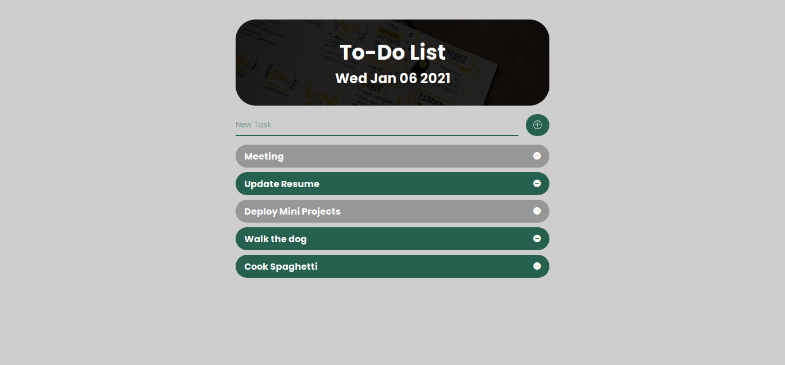

### ✨ [Mini Project - Todo-List App (Click to see live version)](https://krrb-prod-todolistv2.netlify.app/)

>> ###### Features:
>> - [x] Best on desktop and ipad
>> - [x] Uses Object Oriented Programming style
>> - [x] Uses localstorage for data persistence

## Author: <i>Kevin Roi R. Basina</i>

<a href="https://www.facebook.com/kevinroibasina">
	
<a>

